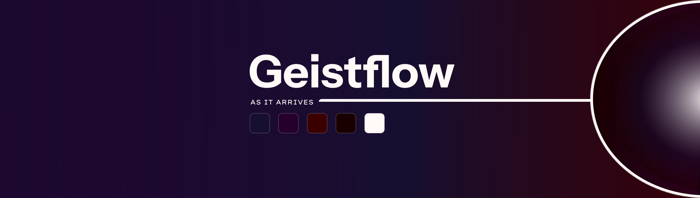

  
  
  # Buddhika Herath
  
  *I build things for the love of building them — and for people.*

Creativity and intuition are where I start; the tools come after. I care, maybe too much — when it's for someone else I try to make it perfect and burn myself doing it. I imagine in big pictures, reach for the whole thing at once, get scorched, and come back to try again. That returning is the one strength I was born with.

I work with **Claude** as a thinking partner — an honest, two-way craft, and I'd rather say so out loud.

Right now I'm building **[Geistflow](https://geistflow.netlify.app)** — a small studio for considered digital things, made with care, on my own terms.

*Not finished. Neither am I. That's rather the point.*
